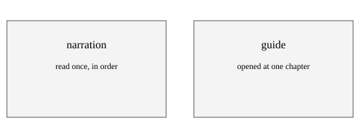
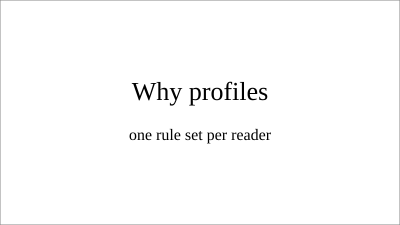

# What a Profile Selects

| | |
|---|---|
| **Act on this** | Run `check-book.sh` on this folder and on `guide-under-narration/`, and compare the two exit codes. |
| **Draws on** | `reference/guide.md`; `scripts/check-book.sh`. |
| **Fills in** | Nothing. Every construct here is one the checker reads. |

## In short

The first chapter of the guide fixture covers the profile, the key in a book's settings file
that names its rule set. Naming a profile changes what the checker holds every chapter to. Two
rule sets exist so that older books keep passing, and this chapter uses four constructs that only
the guide set allows.

[1-1] A set of prose rules was derived from recordings meant to be listened to, and a listener
cannot look back. Every rule in that set is right for someone who starts at the first sentence
and goes to the last. A book opened at one chapter the week it is needed is read differently.
<!-- src: reference/guide.md -->

## Why two sets rather than one

[1-2] Loosening the original set would have left one rule set that is slightly wrong for both
readers. Keeping two means every book written before the second one existed still passes
untouched, which is the property that let this change ship without a migration.
<!-- src: reference/guide.md -->

> **Decide.** Whether a book is a guide is settled once, in the settings file, before any chapter
> is drafted. Changing it afterwards is a rewrite of every chapter rather than an edit.
<!-- src: reference/guide.md -->

[1-3] The **profile** is read from the settings file and never inferred from the chapters. A
checker that guessed the rule set from a heading it found would turn a failure into a silent
reclassification, which is the shape of bug this plugin has been bitten by before.
<!-- src: scripts/check-book.sh -->

## What this chapter uses

### Headings below a part

[1-4] The heading above this paragraph is one level below the part heading. Under the other rule
set it is a failure, because headings there mark parts and nothing else. Here it is what a reader
scanning for one thing lands on.
<!-- src: reference/guide.md -->

### A procedure the reader performs

[1-5] A sequence the reader carries out with the book open is a procedure, and a numbered step is
an address they can return to after looking away. A sequence the reader only has to understand
stays prose, because a chained step says why it follows where a numbered one says where it sits.
<!-- src: reference/guide.md -->

1. Set the profile in the settings file before drafting anything.
2. Run the checker on the folder and read the first line of its output.
3. Confirm the profile it reports is the one you set.
<!-- src: reference/guide.md -->

> **Warning.** A checker that reports a profile you did not set has read a different settings file
> than the one you edited. Check the folder argument before changing anything in the chapters.
<!-- src: scripts/check-book.sh -->

<!-- src: reference/guide.md -->

<!-- src: fill -->

[1-6] The slide above is a teaching aid rather than a figure of the argument, so it carries no
number and stays off the Figures page. The diagram before it is a figure and does both.
<!-- src: reference/guide.md -->

## Suggested reading

- **Feature flags and defaults**: why absent has to mean the old behaviour
- **Progressive disclosure in reference writing**: the literature behind the second reading
- `reference/guide.md`, for the rules a script does not check
